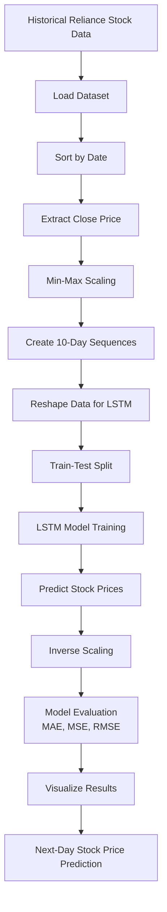
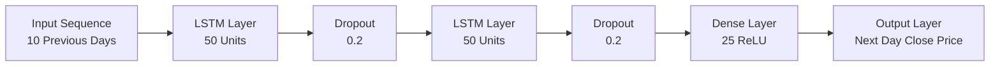
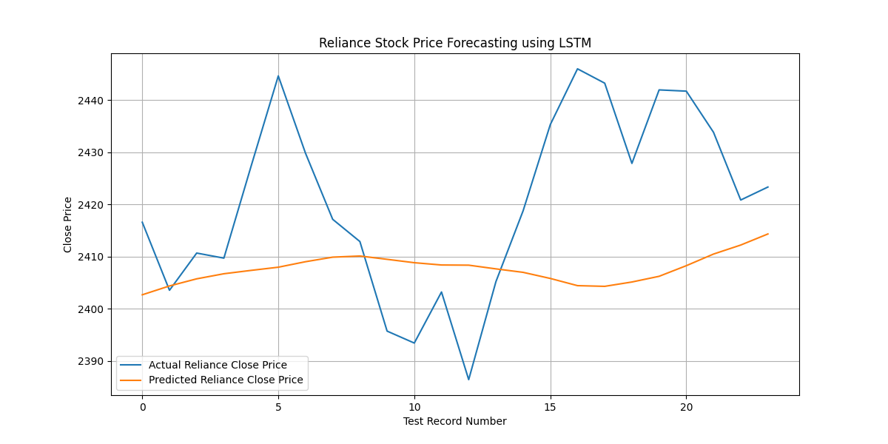
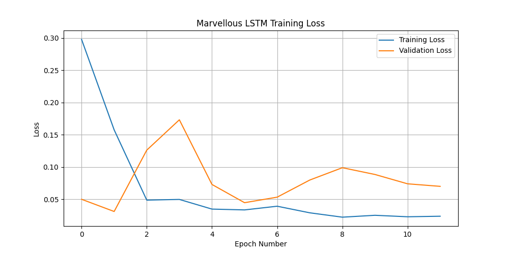

# AI-Based Financial Time Series Forecasting using LSTM

This project predicts the **next-day closing price of Reliance stock** using **LSTM (Long Short-Term Memory)**, a deep learning model designed for sequential and time-series data.  
It uses historical stock prices, applies preprocessing and sequence generation, trains an LSTM model, and forecasts future stock prices.

---

## Features
- Uses **historical Reliance stock price data**
- Extracts **Close price** for forecasting
- Applies **Min-Max Scaling**
- Creates **time-series sequences** using the previous 10 days
- Builds and trains an **LSTM-based deep learning model**
- Predicts stock prices on test data
- Evaluates performance using **MAE, MSE, and RMSE**
- Predicts the **next-day closing price**
- Saves **graphs, trained model, and prediction output CSV**

---

## Technologies Used
- Python
- NumPy
- Pandas
- Matplotlib
- Scikit-learn
- TensorFlow / Keras

---

## Project Workflow



---

## Model Architecture



---

## Project Workflow Summary
1. Load the stock dataset  
2. Convert and sort data by date  
3. Extract **Close** price column  
4. Scale the close prices using **MinMaxScaler**  
5. Create input sequences of **10 previous days**  
6. Reshape data for LSTM input  
7. Build and train the LSTM model  
8. Predict stock prices on test data  
9. Convert predicted values back to original scale  
10. Evaluate the model and visualize results  
11. Predict the **next-day stock closing price**

---

## Files in Project
- `Reliance_LSTM_Time_Series.py` → Main project code  
- `README.md` → Project documentation  
- `marvellous_reliance_stock_sample.csv` → Dataset  
- `marvellous_actual_vs_predicted_detailed.png` → Actual vs predicted graph  
- `marvellous_training_loss_detailed.png` → Training and validation loss graph  
- `marvellous_reliance_lstm_detailed_model.h5` → Saved trained model  
- `marvellous_reliance_prediction_output.csv` → Prediction results  

---

## Results

### 1) Actual vs Predicted Reliance Close Price
This graph compares the **actual closing prices** of Reliance stock with the **LSTM-predicted closing prices** on the test dataset.



### 2) Training and Validation Loss
This graph shows the **training loss** and **validation loss** during model training, helping visualize how the LSTM model learned over epochs.



---

## How to Run

### 1. Install required libraries
```bash
pip install numpy pandas matplotlib scikit-learn tensorflow
```

### 2. Keep the dataset file in the same folder as the Python script

### 3. Run the project
```bash
python Reliance_LSTM_Time_Series.py
```

---

## Output Generated
After execution, the project generates:
- **Predicted stock prices**
- **Actual vs Predicted graph**
- **Training vs Validation Loss graph**
- **Next-day stock price forecast**
- **Saved trained LSTM model**
- **Prediction output CSV**

---

## Purpose of the Project
The purpose of this project is to demonstrate how **LSTM networks can learn patterns from historical stock price data** and use them to forecast future prices.  
It is a beginner-friendly implementation of **financial time-series forecasting using deep learning**.

---

## Future Improvements
- Use **Open, High, Low, Volume** along with Close price
- Add **technical indicators** like RSI, MACD, and Moving Average
- Use **larger historical datasets**
- Try **GRU, Bidirectional LSTM, or Transformer-based forecasting**
- Build a **Streamlit dashboard** for interactive stock prediction

---

## Interview Summary
This project uses **LSTM (Long Short-Term Memory)** to forecast the next-day closing price of Reliance stock using historical time-series data. It includes **data preprocessing, scaling, sequence generation, LSTM model training, prediction, evaluation, and future price forecasting**.
